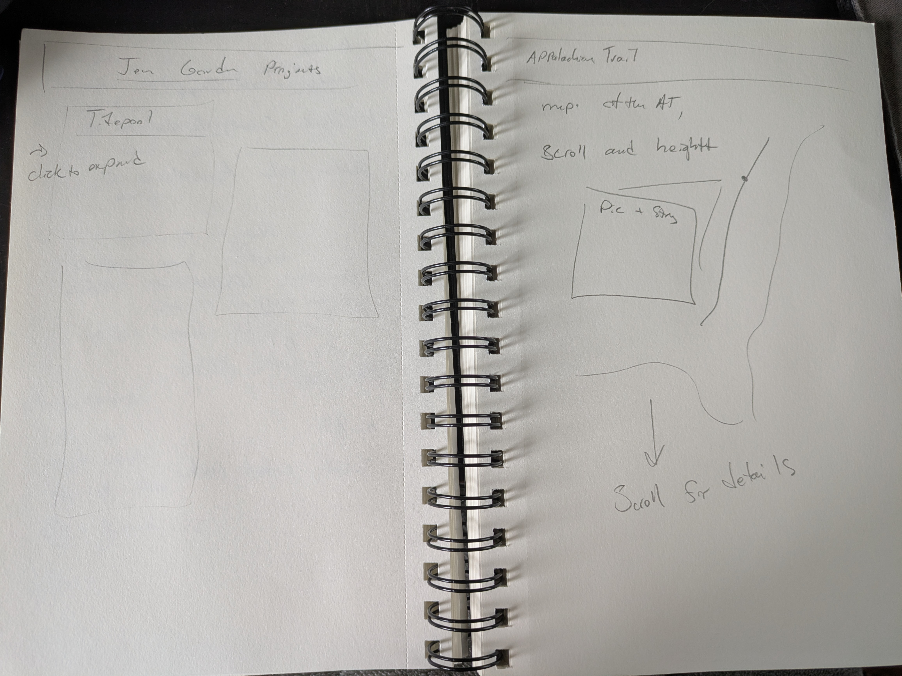

# Design Document
## Project description

This project has two main goals. The first is to showcase my experience as an engineer. But secondly, I've always struggled how to showcase my experience as a hiker as relevant to a career. In 2022 I hiked 2193.7 miles on the Appalachian trail. It's maybe the longest time I've spent without a laptop, and relied on my phone entirely for communication, directions, and company for many parts. I throughly tested the offline capacity of apps, as well as seeing the effect that internet has on battery life.
 
And it very much shaped me as a person. My goal for this project is to communicate both of these things, and share them.

## User Profiles
### User 1 - Janet is a recruiter for a software company. She's Hiring, but has so many applications to look at
### User 2 - Alex is a Hiker, and thinking about hiking the Applachian Trail. They're really worried it's going to be to remote for them
### User 3 = Mary has a Hiking company startup. She's looking for a canidate who knows hiking, as well as a flexible skillset for a startup

## User stories
### Story 1
As a recruiter for a sofware engineering company, I'm interested in assesing a canidate for the skills that they have. I'm intersted in hiring both full stack and backend engineers, and want to briefly browse Jen's projects and see if she's a good fit for the job

### Story 2
As a potential hiker that wants to someday hike a long trail, I'd like to look at Jen's experience on trail to see if it's a good fit for me.

### Story 3
As someone who's at a tech startup, looking for ways to diffentiate canidates, I'm interested in soft skills as well as hard ones. As such, I look at Jen's trail experience to see if she would be a good culteral fit at my worlplace

## design mockups

